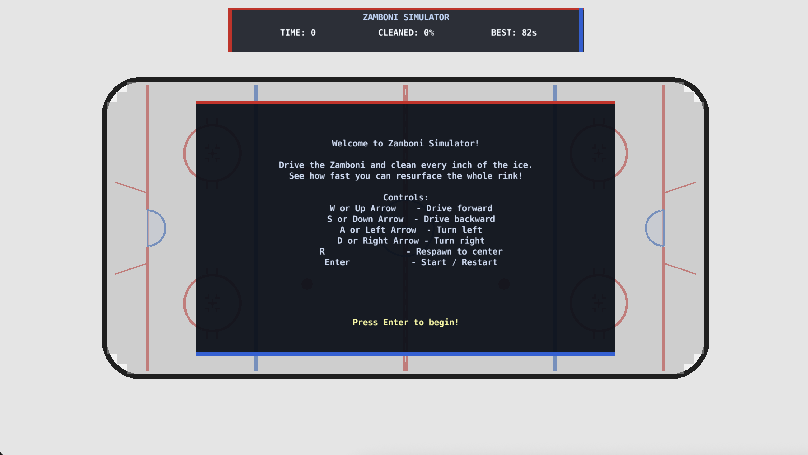
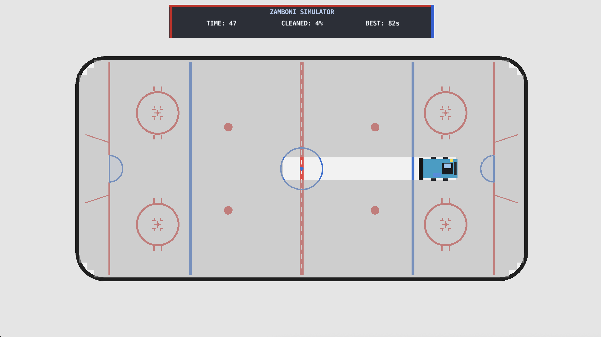
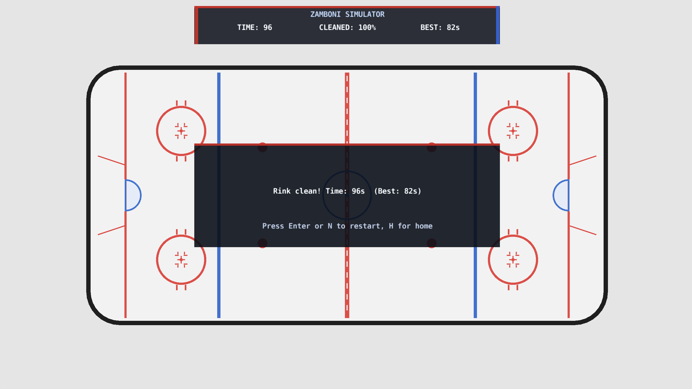

# Zamboni Simulator

A top-down Defold hockey-rink cleaning game where you drive a zamboni around the ice, clear every dirty tile, and try to finish as fast as possible.

The game was built to feel simple to pick up, but still rewarding to master. You start on a rink that fills with dirty ice, then steer the zamboni through the arena until every section has been resurfaced. The timer counts up from zero, so your goal is to get the best completion time you can.

## Screenshots

### Main Menu / How to Play

### Gameplay

### End of Round

## Features

- Smooth top-down zamboni driving with wall sliding and corner handling
- Full-rink cleaning gameplay with visible dirty ice overlay
- Timer that counts up from zero for a speedrun-style finish
- Best-time high score tracking
- Welcome screen and end-of-round popups
- Keyboard support for WASD, arrow keys, Enter, H, N, and R
- Clean Defold UI split across the rink overlay and HUD fallback paths

## Controls

- W / Up Arrow: drive forward
- S / Down Arrow: drive backward
- A / Left Arrow: turn left
- D / Right Arrow: turn right
- Enter: start the game from the home screen
- H: return to the home screen at any time
- N: restart the current game session from scratch
- R: respawn the zamboni to its original spawn position during a round

## How To Play

1. Start the game from the welcome screen.
2. Drive the zamboni around the rink.
3. Clean every dirty tile on the ice.
4. Use the timer and high score to beat your best run.
5. If you get stuck, use R to snap back to the spawn point.
6. Use H to return to the home screen, or N to restart the entire session.

## Running The Game

This project is built in Defold.

1. Open the project in Defold.
2. Run the main collection from the editor.
3. Play using the keyboard controls above.

## Project Structure

- `game/` - round flow, scoring, restart logic, and high score handling
- `player/` - zamboni movement and spawn/reset behavior
- `systems/` - rink generation and ice quality logic
- `ui/` - rink overlay, scoreboard, welcome screen, and zamboni GUI
- `input/` - keyboard bindings
- `docs/screenshots/` - reference images for the README

## Notes

- The game keeps the zamboni inside the rink and uses wall sliding to reduce sticky corner behavior.
- The dirty ice overlay is drawn directly in the rink UI so it stays visible.
- The best time is stored locally with Defold save data.
- The HUD and fallback rink UI both receive score and popup updates so the game remains visible even if one UI path is hidden.

## Milestones

The early build notes are kept in:

- [Milestone 1 - Step 1](docs/milestone-1-step-1.md)
- [Milestone 1 - Step 2](docs/milestone-1-step-2.md)

## Credits

Made with Defold.
